# Remo-Windows

Remo-Windows is a high-performance remote desktop and cloud gaming solution written in Rust. It provides low-latency screen sharing, audio streaming, and input control capabilities using WebRTC technology.

## Demo

Repository:
The demo repository is available [here](https://github.com/adidharmatoru/remo-windows)

Download:
Download directly from [latest release](https://github.com/adidharmatoru/remo-windows/releases)

## Client

Repository:
The client repository is available [here](https://github.com/adidharmatoru/remo)

## Features

### 🎯 Core Capabilities

| Feature | Description | Platform Support | Hardware Acceleration |
|---------|-------------|------------------|----------------------|
| **Screen Capture** | Hardware-agnostic Hardware-accelerated screen capture | Windows (WGC), macOS (ScreenCaptureKit, TBD), Linux (X11/Wayland, TBD) | ✅ GPU Direct |
| **Audio Streaming** | Real-time audio capture and streaming | All platforms | ✅ Hardware Codecs |
| **Video Encoding** | Hardware-agnostic Zero-copy H.264/AV1 encoding | All platforms | ✅ NVENC, QSV, AMF |
| **Audio Encoding** | Opus audio codec | All platforms | ✅ Hardware Accelerated |
| **WebRTC Transport** | Low-latency streaming with adaptive bitrate | All platforms | ✅ Hardware Offload |

### 🎮 Input Control

| Input Type | Features | Windows | macOS | Linux |
|------------|----------|---------|-------|-------|
| **Keyboard** | Full keyboard input forwarding | ✅ | ✅ | ✅ |
| **Mouse** | Precision mouse control with wheel support | ✅ | ✅ | ✅ |
| **Gamepad** | Xbox 360 controller emulation via ViGEmBus | ✅ | ❌ | ❌ |
| **Multi-Controller** | Support for multiple simultaneous controllers | ✅ | ❌ | ❌ |

### 🚀 Performance Features

| Feature | Benefit | Implementation |
|---------|---------|----------------|
| **Zero-Copy Pipeline** | Eliminates 2-4ms CPU copy time per frame | Direct GPU memory mapping |
| **Async Encoding** | Non-blocking GPU operations | Achieving sub 4ms average per frame |
| **Adaptive Bitrate** | Dynamic quality adjustment | WebRTC bandwidth estimation |
| **Hardware Acceleration** | 50% reduction in memory bandwidth | Direct3D11 / Metal (TBD) / Vulkan (TBD) |
| **High Priority Threading** | Time-critical thread scheduling | OS-level priority boosting |

### 🌐 Network & Transport

| Protocol | Purpose | Features |
|----------|---------|----------|
| **WebRTC** | Primary transport | ICE, DTLS, SRTP, adaptive bitrate |
| **QUIC** | Alternative transport (WIP) | Low-latency, multiplexed streams |
| **WebSocket** | Signaling | Secure connection establishment |
| **STUN/TURN** | NAT Traversal | Automatic firewall bypass |

### ⚙️ Configuration

| Category | Configurable Options |
|----------|---------------------|
| **Video** | Resolution, framerate, bitrate, codec, pixel format, native / on-screen cursor |
| **Audio** | Sample rate, channels, bitrate, codec, frame duration |
| **Network** | STUN/TURN servers, MTU, port ranges, relay forcing |
| **Control** | Keyboard/mouse/controller enable/disable |

## Zero-Copy Hardware Acceleration Pipeline

```mermaid
%%{init: {"flowchart": {"defaultRenderer": "dagre"}}}%%
flowchart LR

    %% AUDIO CAPTURE
    subgraph ACAP["🎙 AUDIO CAPTURE"]
        A1["• Hardware processing<br>• low-latency buffer"]
    end

    %% VIDEO CAPTURE
    subgraph VCAP["🎥 VIDEO CAPTURE"]
        V1["WGC / ScreenCaptureKit / X11<br>→ GPU Textures"]
    end

    %% AUDIO CONVERSION
    subgraph ACONV["🎵 AUDIO CONVERSION"]
        A2["**Opus Encoding**<br>• Low-latency audio codec"]
    end

    %% VIDEO CONVERSION
    subgraph VCONV["🎞 VIDEO CONVERSION"]
        V2["**GPU Color Space Conversion**<br>BGRA → YUV (420/422/444) via shaders<br>• D3D11 Compute (Windows)<br>• Metal Compute (macOS)<br>• Vulkan Compute (Linux)"]
    end

    %% AUDIO ENCODING
    subgraph AENC["🔊 AUDIO ENCODING"]
        A3["**Opus**<br>Encoded audio packets for transmission"]
    end

    %% VIDEO ENCODING
    subgraph VENC["⚡ VIDEO ENCODING (GPU)"]
        V3["**GPU Encoding Pipeline**<br>Zero-copy mapping,<br>• NVIDIA NVENC (TESTED)<br>• AMD AMF<br>• Intel QSV<br>• Software encoding"]
    end

    %% TRANSPORT
    subgraph TRANS["📡 WebRTC / MoQ"]
        T1["**A/V Stream**<br>RTP or QUIC transport with encryption & FEC"]
    end

    %% INPUT HANDLING
    subgraph INPUT["🎮 INPUT HANDLING"]
        I1["**WebRTC Datachannel / QUIC WebTransport → System**<br>low-latency injection<br>• Mouse simulation (user space)<br>• Keyboard simulation (user space)<br>• Gamepad emulation (kernel level)"]
    end

    %% FLOW CONNECTIONS
    A1 --> A2 --> A3 --> T1
    V1 --> V2 --> V3 --> T1
    T1 --> I1

    %% STYLING
    classDef audio fill:#e1f5fe,stroke:#0288d1,color:#01579b,stroke-width:2px;
    classDef video fill:#f3e5f5,stroke:#8e24aa,color:#4a148c,stroke-width:2px;
    classDef encode fill:#e8f5e9,stroke:#43a047,color:#1b5e20,stroke-width:2px;
    classDef transport fill:#fce4ec,stroke:#f06292,color:#880e4f,stroke-width:2px;
    classDef input fill:#f1f8e9,stroke:#aed581,color:#33691e,stroke-width:2px;

    class A1,A2,A3 audio;
    class V1,V2,V3 video;
    class T1 transport;
    class I1 input;

    style A1 fill:#e1f5fe,stroke:#0288d1,color:#01579b,stroke-width:2px,text-align:center,min-width:300px;
    style A2 fill:#e1f5fe,stroke:#0288d1,color:#01579b,stroke-width:2px,text-align:center,min-width:300px;
    style A3 fill:#e1f5fe,stroke:#0288d1,color:#01579b,stroke-width:2px,text-align:center,min-width:300px;
    style V1 fill:#f3e5f5,stroke:#8e24aa,color:#4a148c,stroke-width:2px,text-align:center,min-width:300px;
    style V2 fill:#f3e5f5,stroke:#8e24aa,color:#4a148c,stroke-width:2px,text-align:center,min-width:300px;
    style V3 fill:#f3e5f5,stroke:#8e24aa,color:#4a148c,stroke-width:2px,text-align:center,min-width:300px;
    style T1 fill:#fce4ec,stroke:#f06292,color:#880e4f,stroke-width:2px,text-align:center,min-width:300px;
    style I1 fill:#f1f8e9,stroke:#aed581,color:#33691e,stroke-width:2px,text-align:center,min-width:300px;
```


## Getting Started

### Prerequisites

1. Install Rust and Cargo (https://rustup.rs/)
2. Required system dependencies:
   - FFmpeg libraries for video/audio encoding
   - Screen capture capabilities (Windows: DXGI, macOS: ScreenCaptureKit, Linux: X11/Wayland)
   - ViGEmBus driver (Windows-only, for controller support)

### Installation

1. Clone the repository:
```bash
git clone https://github.com/adidharmatoru/remo-windows.git
cd remo-windows
```

2. Build the project:
```bash
cargo build --release
```

### Running

```bash
cargo run --release
```

## Development

### Running Tests

```bash
cargo test
```

### Test Coverage

```bash
cargo install cargo-tarpaulin
cargo tarpaulin
```

## License

This project is licensed under the MIT License - see the LICENSE file for details.